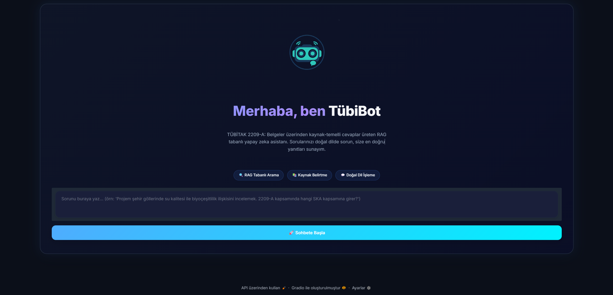
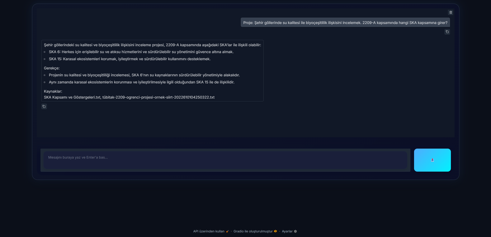

# 🎓 TübiBot — TÜBİTAK 2209-A RAG Chatbot

<p align="left">
  <a href="https://huggingface.co/spaces/BurakLecuy/tubibot-2209a">
    
  </a>
</p>

> 2209-A başvurularına belge temelli cevaplar veren, Türkçe RAG tabanlı bir chatbot.

## 📋 Proje Hakkında

**TübiBot**; TÜBİTAK 2209-A çağrı duyurusu, başvuru formları, rehberler, örnek başvurular ve SKA dokümanları gibi PDF kaynaklarından metin çıkarır, bu metinleri vektör indekse yazar ve sorulara **kaynak temelli cevap** üretir.

- Arayüz: **Gradio**
- LLM: **Gemini 2.0 Flash**
- Embedding: **BAAI/bge-m3**
- Vektör Veritabanı: **ChromaDB**
- Özellik: Kısa konuşma hafızası ile son 3 turu dikkate alır


## Canlı Demo
Projeyi tarayıcıdan deneyin: **https://huggingface.co/spaces/BurakLecuy/tubibot-2209a**

## 🖼️ Ekran Görüntüleri

<p align="center">
  <br/>
  <em>Ana ekran</em>
</p>

<p align="center">
  <br/>
  <em>Sohbet ekranı</em>
</p>


## 🛠️ Kullanılan Teknolojiler

| Teknoloji | Açıklama |
|-----------|----------|
| **Gradio** | Modern web arayüzü (ChatGPT tarzı "hero → chat" akışı) |
| **ChromaDB** | Vektör veritabanı (kalıcı chroma_store/) |
| **Sentence Transformers** | BAAI/bge-m3 embedding modeli |
| **Google Gemini** | gemini-2.0-flash ile metin üretimi |
| **LangChain** | Topluluk paketleri, Chroma ve HF Embeddings entegrasyonu |
| **python-dotenv** | .env ile anahtar yönetimi |

## 🚀 Kurulum

> Windows/PowerShell örnekleri verilmiştir. Diğer platformlarda komut uyarlaması yapabilirsin.

### 1) Gerekli Paketler

```bash
py -m pip install -r requirements.txt
```

### 2) API Anahtarını Ayarla

Proje kökünde `.env` oluştur:
```
GEMINI_API_KEY=your_google_api_key_here
```

> **Google API Key:** Google AI Studio üzerinden oluşturduğun anahtar.

### 3) Veriyi Hazırla (PDF → TXT → Vektör İndeks)

PDF'lerini `data/pdfs/` klasörüne koyduktan sonra:

```bash
py pdfden_metin_cikar.py
py indeks_olustur_chroma.py
```

### 4) Uygulamayı Çalıştır

```bash
py app.py
```

Tarayıcı otomatik açılmazsa [http://127.0.0.1:7860/](http://127.0.0.1:7860/) adresini ziyaret et.

## 📁 Proje Yapısı

```
2209A-Chatbot/
├─ app.py                       # Gradio arayüz
├─ sor_chroma.py                # RAG akışı + son 3 tur hafıza + prompt + sampling
├─ indeks_olustur_chroma.py     # TXT'leri chunklayıp Chroma indeksi oluşturur
├─ pdfden_metin_cikar.py        # PDF → TXT çıkarımı
├─ data/
│  ├─ pdfs/                     # Kaynak PDF'ler
│  └─ text/                     # Çıkarılan .txt (otomatik üretim)
├─ chroma_store/                # Chroma vektör indeksi (otomatik üretim)
├─ logo.png                     # (Opsiyonel) Arayüz logosu / bot avatarı
├─ .env                         # GEMINI_API_KEY (git'e eklenmez)
├─ .gitignore
├─ requirements.txt
└─ README.md
```

## 💡 Nasıl Çalışır?

1. **Veri Yükleme:** PDF'ler data/pdfs/ klasöründe tutulur.
2. **Belge İşleme:** pdfden_metin_cikar.py ile metin çıkarılır, satır/küçük parçalara ayrılır.
3. **Embedding:** Parçalar BAAI/bge-m3 ile vektörlere dönüştürülür.
4. **Vektör Veritabanı:** Vektörler ChromaDB'ye yazılır (chroma_store/).
5. **Sorgulama (RAG):** Kullanıcı sorusu embed edilir → en ilgili parçalar bulunur.
6. **Yanıt Üretimi:** Gemini 2.0 Flash, RAG bağlamı + son 3 mesaj hafızasıyla cevap üretir.
7. **Politika:** Prompt; "Varsayımlı çıkarım" etiketli açıklama ve Kaynaklar bölümünü zorunlu tutar. (Belge yoksa "Kaynaklarda net bilgi bulamadım.")

## 🎯 Örnek Sorular

- "2209-A bütçede uygun harcama kalemlerini 3 maddeyle özetle."
- "Projem şehir göllerinde su kalitesi ile biyoçeşitlilik ilişkisini incelemek. 2209-A kapsamında hangi SKA kapsamına girer?"
- "Projem için ilgili SKA hedeflerini numaralarıyla ve kısa gerekçeyle yaz."
- "Konaklama gideri destekleniyor mu? Kısa ve net yaz."

## ⚙️ Önemli Ayarlar

- **Hafıza:** Son 3 tur sohbet (chat_memory.json)
- **Sampling:** temperature=0.7, top_p=0.95, top_k=40
- **Model adları:**
  - Embedding: BAAI/bge-m3
  - LLM: gemini-2.0-flash

## 🧪 Kullanım İpuçları

- Aynı soruyu birkaç kez sorarsan ufak çeşitlilik normaldir (temperature).
- Daha tutarlı istersen temperature=0.3 yapabilirsin (sor_chroma.py).
- Cevap çok "geniş" veya "kararsız" geldiğinde: sorunu daha spesifik yaz, "3 madde", "150–180 kelime" gibi kısıt ver.

## 🗂️ Veri Seti (Kendi Hazırladığım)

Bu projede kullanılan veri seti, tarafımdan derlenmiş resmi ve örnek dokümanlardan oluşur. Amaç, TÜBİTAK 2209-A başvuru sürecinde başvuru sahibine belge-temelli ve güncel bilgi sunmaktır.

### Kaynak Türleri

- Çağrı dokümanları / duyurular (örn. 2209-A 2025 çağrı duyurusu)
- Başvuru formları ve rehberler (genel bilgiler, yazım kılavuzları, bütçe kuralları)
- Örnek başvurular / kabul görmüş örnekler (referans olarak)
- SKA (Sürdürülebilir Kalkınma Amaçları) dokümanları (proje-SKA eşlemesi için)

> **Not:** Dokümanlar yalnızca bilgilendirme ve eğitim amacıyla kullanılmıştır; içeriklerin nihai doğruluğu için her zaman resmi kaynaklar önceliklidir.

## 🐛 Sorun Giderme

| Sorun | Çözüm |
|-------|-------|
| **ModuleNotFoundError** | `py -m pip install -r requirements.txt` |
| **GEMINI_API_KEY yok uyarısı** | .env içinde anahtar var mı? Dosya proje kökünde mi? |
| **Cevap "Kaynaklarda net bilgi yok" diyor** | İlgili PDF gerçekten var mı? pdfden_metin_cikar.py ve indeks_olustur_chroma.py'yi yeni PDF'lerden sonra tekrar çalıştır. |
| **İndeks ağır / repo şişiyor** | chroma_store/, data/text/, chat_memory.json, .env dosyaları .gitignore'da olmalı. |
| **Türkçe karakter / sayfa numarası hataları** | Bu PDF'e özgü olabilir; metin çıkarımı için alternatif bir extractor denenebilir. |

## 📌 Notlar

- Bu proje 2209-A başvuru sürecinde danışman chatbot olarak tasarlanmıştır.
- Cevaplar kaynak metinlere dayanır; mevzuat değişikliklerinde PDF setini güncelleyip yeniden indeks oluşturmalısın.